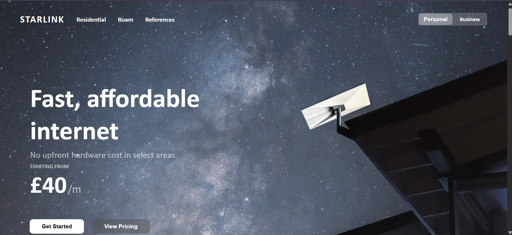
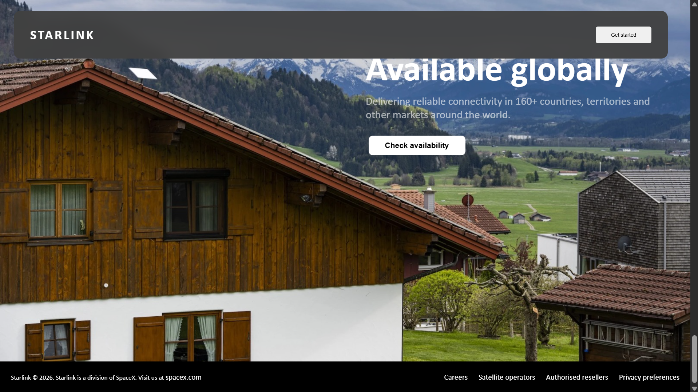
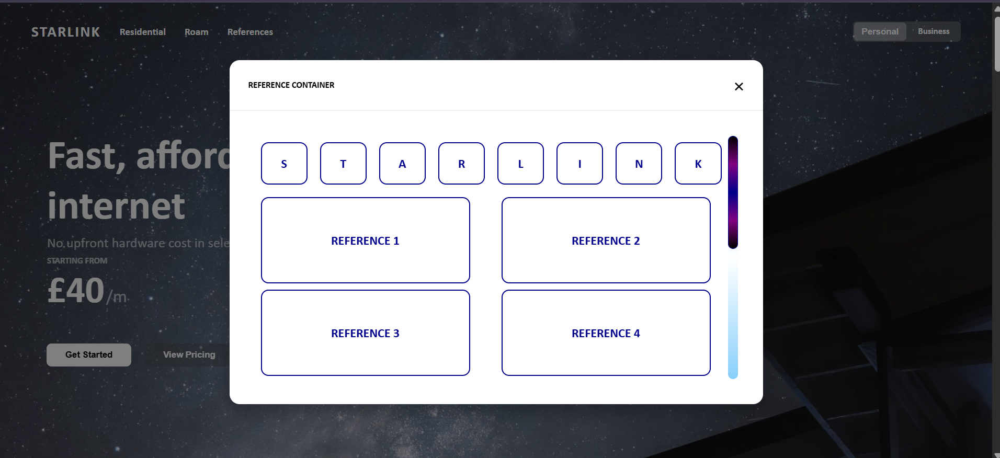
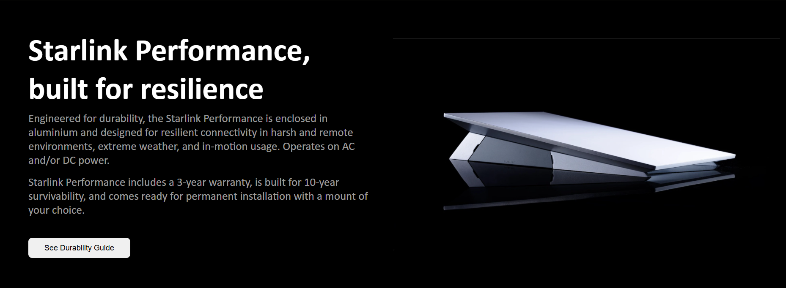
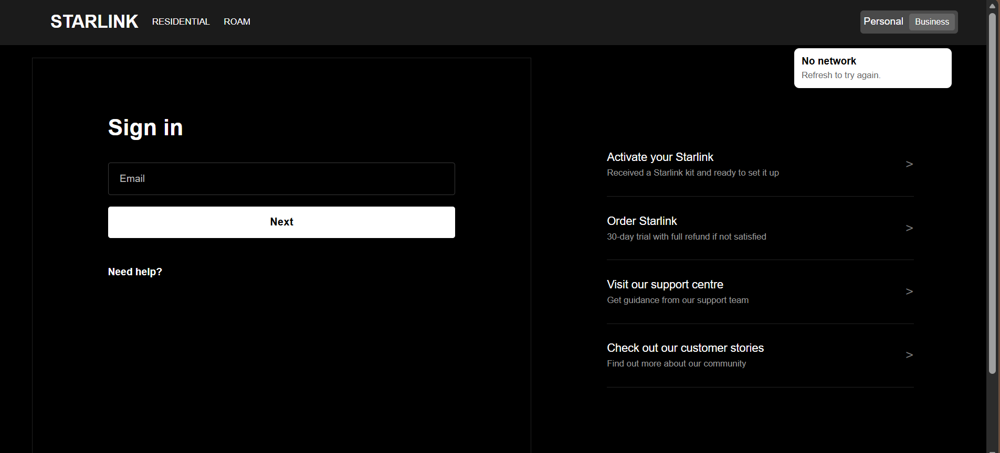

# Starlink Clone

A collection of Starlink-inspired website recreations I built while practising HTML and CSS.

## Projects

### Starlink Landing Page

A recreation of the Starlink landing page featuring:

- Navigation bar
- Interactive modal overlay
- Custom overflow scrollbar
- CSS animation
- Modal triggered from the navigation

### Starlink Business & Sign In

Recreations of the Starlink business page and sign-in page, including a network-status card.

## What I Practised

- HTML structure
- CSS styling
- Layout and positioning
- Navigation
- Modal overlays
- Overflow and scrollbars
- CSS animations
- Recreating existing web interfaces

## Project Structure

- `interactive-overlay-and-scrollbar-starlink-landingpg/` — Starlink landing page
- `starlink-bussiness-signin-network-card/` — Business and sign-in pages
- `images/` — Project images and assets

## Screenshots

### Starlink Landing Page

### Interactive Modal

### Starlink Business

### Sign In & Network Card

